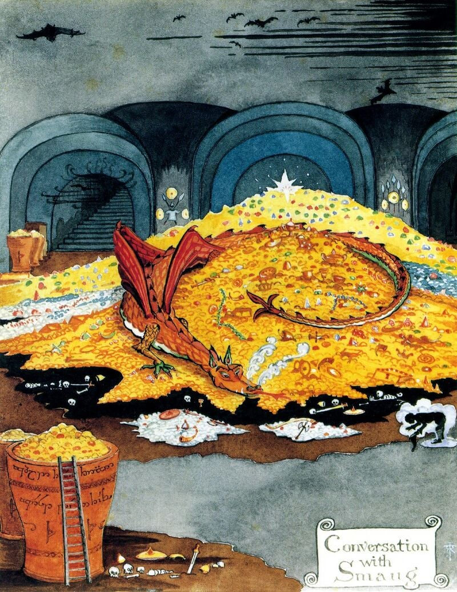

# colossus
A small, unoptimizing C compiler with a custom TAC IR targetting ARMv6-ish. 
This library crate is mainly for self-study of the 
[Green Dragon Book](https://en.wikipedia.org/wiki/Principles_of_Compiler_Design), 
and is named after [Colossus](https://en.wikipedia.org/wiki/Colossus_computer) in the spirit of building from the MOSFET up.

  

